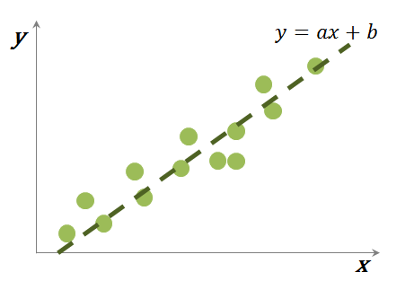
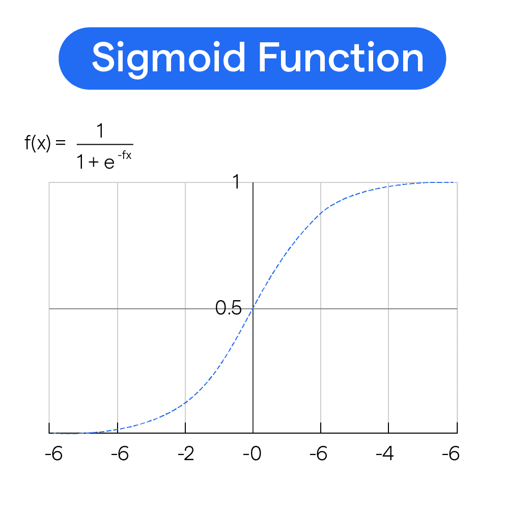

# Logistic Regression
간단히 말하면 해당 데이터가 어떠한 범주에 속할지 0 ~ 1 사이의 확률 값으로 변환하고,   
해당 확률을 가지고 가능한 범주에 분류해 주는 지도 학습.

Sigmoid를 사용하여 확률 값이 0 ~ 1이고 일정 threshold가 넘으면 1 나머지는 0등 으로 나눠주는 방식.   
즉, binary classification (이진 분류) 문제를 풀때 많이 사용함.   

$$\sigma(z) = \frac{1}{1 + e^{-z}}$$

이건 로지스틱 함수 또는 시그모이드라고 칭한다.   

이제 이 함수가 어떻게 나왔는지 알아보자 (Logit Function, Odds)를 먼저 알아야함.   

$$
\text{odds} = \frac{P}{1 - P} = \frac{P(y=1 | x)}{1 - P(y=1 | x)}
$$

위에 수식의 뜻은 어떠한 일이 발생할 확률 P, 즉 의료 분야에서 질병이 있는 경우 P, 없는 경우 1 - P.   
이들 중에서 질병이 있는 경우 확률이 발생하지 않을 확률에 비해 몇 배나 높은가를 구하는것.   

## Method
   
이어서 위에 그림처럼 x값은 -inf ~ inf 범위를 가진다. y값도 역시 -inf ~ inf값으 가지지만,   
반대로 logistic regression에서는 x는 -inf ~ inf범위를 가지지만 y값은 확률인 0 ~ 1이기에 이를 -inf ~ inf값으로 변경해줘야한다.

$$y = ax + b$$
*여기서 output y를 확률 p로 바꿔준다. 하지만 y는 확률이기에 성립하지 않는다.   

$$
\text{Odds} = \frac{P}{1 - P} = ax + b
$$
 
그러면 Odds를 사용해보자 (Odds)는 0 ~ inf 값을 갖는다.   

$$
\log_e(\text{Odds}) = \log_e\left(\frac{P}{1 - P}\right) = ax + b
$$

이제 해당 값인 log를 취해 범위를 -inf ~ inf 으로 변환해준다. 

## [로그 특성상]   
+ P가 `작으면` log  `마이너스 값`이 나오고,   
+ P가 `0.5`이면 log 값은 `0`,   
+ P가 `1에` 가까우면 `큰 값`이 나온다.   

---

이제 위에서 구한 수식에 e를 각각 왼쪽 오른쪽 씌워준다. 

$$
e^{\log_a\left(\frac{P}{1 - P}\right)} = e^{ax + b}
$$

$$
\frac{P}{1 - P} = e^{ax + b}
$$
 
---   
그 다음 해당 수식에 역수를 취해준다.

$$
\frac{1 - P}{P} = \frac{1}{e^{ax + b}}
$$

$$
\frac{1}{P} - 1 = \frac{1}{e^{ax + b}}
$$

---  

-1 을 없애기 위해 왼쪽 오른쪽 모두 1씩 더해준다. 

$$
\frac{1}{P} = \frac{1}{e^{ax + b}} + 1
$$

$$
\frac{1}{P} = \frac{1 + e^{ax + b}}{e^{ax + b}}
$$
 
---   

마지막으로 역수를 취해주면 sigmoid랑 같은 수 다시말해 로지스틱 함수를 얻을 수 있다.     

$$
P = \frac{e^{ax + b}}{1 + e^{ax + b}}
$$

* 아니 분명 다르게 생겼는데 왜 같은거라는거야 ? 밑에 수식을 이어서 보자.   
$$
f(x) = \frac{1}{1 + e^{-x}} = \frac{e^{x}}{1 + e^{x}}
$$

왼쪽 오른쪽 전부 $e^{x}$ 를 곱해주면 같은 값을 얻을 수 있다.

---
# Sigmoid

[Link](https://pinkwink.kr/1383) cross entropy + code
