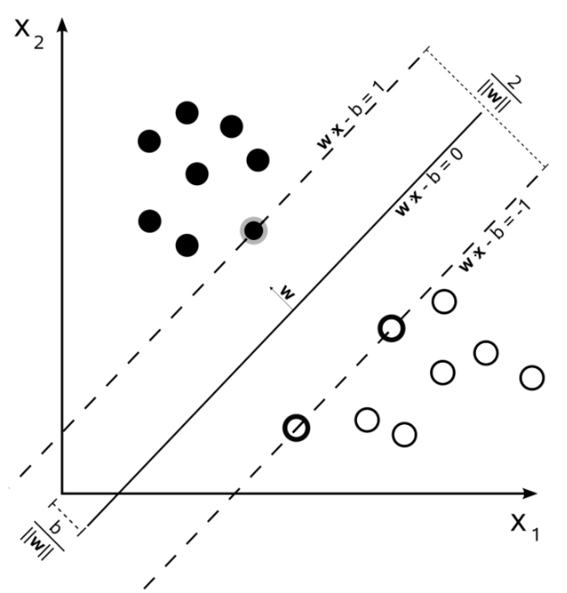

# SVM
SVM (Support Vector Machine) is primarily aimed at finding a decision boundary that is as far away as possible from two classes, and it uses this boundary to classify the data.

</img>

Basically, SVM uses the term *margin*, which refers to the boundary that separates two datasets. In other words, the main goal of SVM is to find the maximum margin that perfectly classifies the two classes.

---

Now that we understand the concept, let's write a simple code to practice.

First, the hyperplane equation for SVM is as follows : $𝑤^T x + 𝑏 = 0$  
+ $x_i$: Data points   
+ $y_i$: The label of the data points, which is either +1 or -1.

---

Also => $w_0 x_0 + w_1 x_1 + b = 0$  

- $w_0, w_1$: Two elements of the weight vector that determine the slope of the hyperplane.
- $x_0, x_1$: Two dimensions of the data points (coordinates on the x-axis and y-axis in a 2D space).
- $b$: The intercept of the hyperplane.

Thus, $w^T x + b = 0$ represents the decision boundary (hyperplane).

### Solving for the y-value in a 2D plane
When dealing with this equation in 2D,  
$x_0$ can be interpreted as the value on the x-axis, and $x_1$ as the value on the y-axis. Solving this equation for the y-value results in the following:

$$
w_0 x_0 + w_1 x_1 + b = 0 \\
w_1 x_1 = -w_0 x_0 - b \\
x_1 = \frac{-w_0 x_0 - b}{w_1}
$$

```python
def get_hyperplane_value(x, w, b, offset):
    return (-w[0] * x - b + offset) / w[1]
```

---

# Code
## Direct implementation (https://github.com/TCK2001/Machine_Learning/blob/main/Logistic_Regression/svm.py) 
## Sklearn library ()
### ⭐Parameters
| Parameter | Default | Description |
|-----------|---------|-------------|
| C         | 1.0     | How much error to allow (regularization term). A larger value makes it closer to a hard margin, while a smaller value makes it closer to a soft margin. |
| kernel    | 'rbf' (Gaussian kernel) | Specifies the kernel type to be used. Options are 'linear', 'poly', 'rbf', 'sigmoid', and 'precomputed'. |
| degree    | 3       | Determines the degree of the polynomial kernel. |
| gamma     | 'scale' | Decides how flexible the decision boundary should be. A larger value increases the likelihood of overfitting. |
| coef0     | 0.0     | Constant term in the polynomial kernel. |

