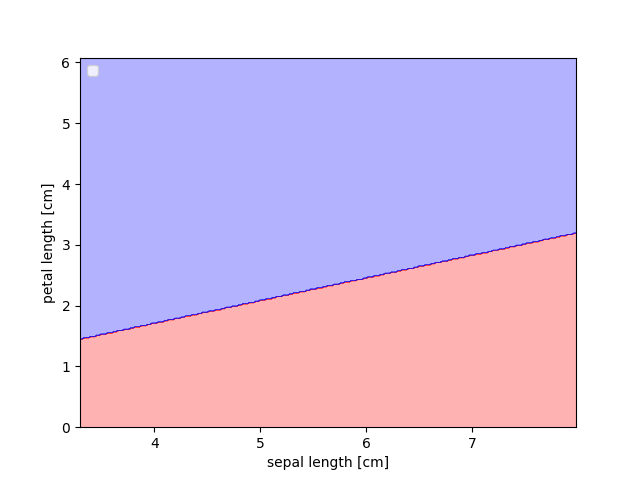
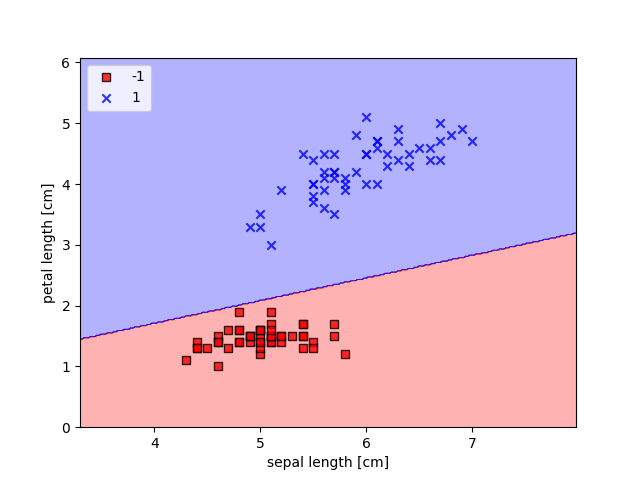

# Visualization_boundary.py
```python
markers = ('s', 'x', 'o', '^', 'v')
colors = ['red', 'blue', 'lightgreen', 'gray', 'cyan']
cmap = ListedColormap(colors[:len(np.unique(y))])
```
Setting the markers、colors.

---

```python
x1_min, x1_max = X[:, 0].min() - 1, X[:, 0].max() + 1
x2_min, x2_max = X[:, 1].min() - 1, X[:, 1].max() + 1
xx1, xx2 = np.meshgrid(np.arange(x1_min, x1_max, resolution), np.arange(x2_min, x2_max, resolution))
```
The process of allocating coordinates to make prediction for all points on a 2D plane.

---

```python
Z = classifier.predict(np.array([xx1.ravel(), xx2.ravel()]).T)
Z = Z.reshape(xx1.shape)
```
Use there coordinates to predict the result, and reshape them to the original shape.

### Let's look at the Visualization result


---

### Lets add the scatter to the result
```python
for idx, cl in enumerate(np.unique(y)):
    plt.scatter(x = X[y == cl, 0], 
                y = X[y == cl, 1],
                alpha = 0.8, 
                c = colors[idx],
                marker = markers[idx], 
                label = cl, 
                edgecolor = 'black')
        
```
`x = X[y == cl, 0]` : sepal length   
`y = X[y == cl, 1]` : petal length

